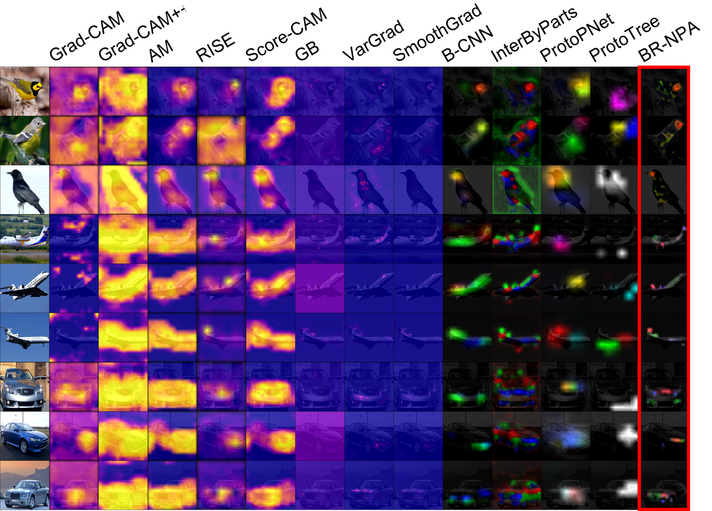

# BR-NPA

The official implementation of the BR-NPA model described in this paper https://arxiv.org/abs/2106.02566



## Data 

Create a folder called `data` at the project root.
Create two folders called 'CUB-200-2011_train' and 'CUB-200-2011_test' in the `data` folder.

Download the train and test images of the CUB-200-2011 dataset and put them in these two folders.

The 'CUB-200-2011_train' and 'CUB-200-2011_test' will be read by an ImageFolder class from Pytorch, so you should follow that format(i.e. one folder per class, with all train/test images from the class in it).

## Training 

Use the `train.sh` script to train models.

To train a low-resolution BR-NPA : 
```
./train.sh br_npa_low_res
```

Note that this starts hyper-parameter optimization, so if you don't want to wait too long, set ```--optuna False``` in the ```train.sh``` script. This will use the default hyper-parameters provided in the config file ```config_cub.config```. 
If you choose to do hyper-parameter optimization, note that optuna will print in the standard error output the performance obtained after each trial. 
It also stores the tried parameters and performances obtained here : 
``` 
../results/CUB/br_npa_low_res_hypSearch.db
```

Check optuna documentation for more information.

Once training is finished, you can check the final accuracy here : 

```
../results/CUB/modelbr_npa_low_res_epoch$BEST_EPOCH_test.csv
```

Where $BEST_EPOCH is the epoch at which the model performed the best during training. If you don't know what it is, just search for a file matching : 

```
../results/CUB/modelbr_npa_low_res_epoch*_test.csv
```

You should get only one match, the file you are looking for. This files also contains the sparsity of the model's attention maps.

The attention maps are saved here : 

``` 
../results/CUB/attMapsbr_npa_low_res_epoch$BEST_EPOCH_test.npy
```

This array contains the attention maps obtained on the test set, in the order in which they were passed to the model.
No shuffle is applied, so if the class folders are correcly numbered you should have the same order.

Don't forget to multiply the attention maps by the norm of the features (which has high impact when aggregating feature vectors) : 

``` 
../results/CUB/normbr_npa_low_res_epoch$BEST_EPOCH_test.npy
```

### Other models 

To train a high-resolution BR-NPA distilled on the low-res BR-NPA you just trained before : 
```
./train.sh br_npa_high_res_distill
```

To train a B-CNN or just a regular CNN : 
```
./train.sh b_cnn
./train.sh cnn
```

If want to train the models used in the ablation study, you can go check the train.sh script, it contains commands to do that.

## The DAUC and IAUC metrics

To compute the DAUC and IAUC metrics, we will use the ```get_dauc_scores.sh``` and ```get_iauc_scores.sh``` scripts.

Use the following script to compute the scores obtained by progressively masking out the images (for DAUC) : 

``` 
./get_dauc_scores.sh br_npa_low_res
```

Use this one to compute the scores when unbluring the image (for IAUC) :

``` 
./get_iauc_scores.sh br_npa_low_res
```

Once its done, compute the metrics : 

``` 
python3 processResults.py --exp_id CUB
```

## License 

This work is under license Creative Commons Attribution Non Commercial Share Alike 4.0 International.

## Citation 

If you use this code please use the following citation : 

```
@misc{https://doi.org/10.48550/arxiv.2106.02566,
  doi = {10.48550/ARXIV.2106.02566},
  url = {https://arxiv.org/abs/2106.02566},
  author = {Gomez, Tristan and Ling, Suiyi and Fréour, Thomas and Mouchère, Harold},
  keywords = {Computer Vision and Pattern Recognition (cs.CV), Machine Learning (cs.LG), FOS: Computer and information sciences, FOS: Computer and information sciences},
  title = {BR-NPA: A Non-Parametric High-Resolution Attention Model to improve the Interpretability of Attention},
  publisher = {arXiv},
  year = {2021},
  copyright = {Creative Commons Attribution 4.0 International}
}
```